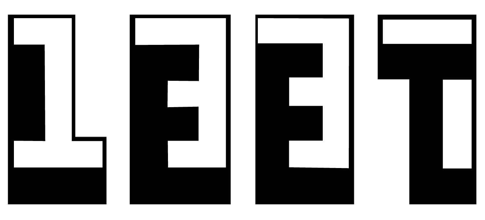

<p align="center">
  
</p>

<p align="center">
    <em>This repository contains all my work-projects during the 1337-42Network pool</em>
</p>

<p align="center">
  <a href="https://ez7mz.me" target="_blank">
        
  </a>
  <a href="https://ensak.usms.ac.ma/ensak/" target="_blank">
        
  </a>
  <a href="https://www.linkedin.com/in/ez7mz/" target="_blank">
    
  </a>
  <a href="https://www.instagram.com/ez7m.z/" target="_blank">
    
  </a>
</p>

---
<br>

# 🏊🏻‍♂️ Pool Or Piscine
The Piscine is an intensive, full-time, 4-week long immersion on the 1337 campus with other eligible candidates like yourself. During this month, we will test your motivation to become a world-class programmer, find out if you are #BornToCode and if you can excel in our peer-to-peer learning environment. The Piscine requires your full-time commitment.

⚠️ The Piscine is the only way to become a student at 1337 and be fully admitted to the course.

<br>

# 🎲 My Experience
It was one of the best experiences of my life because of a lot of things including the learning side and enjoying side. I learned a lot of stuff although I already have an experience in coding when I was there I felt like I really need more hard work to keep going, with all of that I can't forget all the fun times I spent there with some people I never thought that are even exist on earth. and the most valuable thing I learned is that Collaboration is more mush easy to reach the goal in the two ways Easy and Fast. and finally like we said in our language:  "Wast dahk kayena Lkhedma".

<br>

# 👨🏻‍💻 My work
My Piscine was in the period between 18, Jul 1022 AND 12, Aug 2022. I reached 📈 **`Lvl 9.61`** which got me **`Top #6`** ⭐ in my Piscine.

<div align="center">
    <table width=100%>
        <thead border=1>
            <th>Project Title</th>
            <th>Subject</th>
            <th>Solution</th>
            <th>Grade</th>
            <th>Description</th>
        </thead>
        <tr>
            <td align="center">Shell00</td>
            <td align="center"> <a href="">Sub</a> </td>
            <td align="center"> <a href="">Sol</a> </td>
            <td >✔️</td>
            <td align="center"></td>
        </tr>
        <tr>
            <td align="center">Shell01</td>
            <td align="center"> <a href="">Sub</a> </td>
            <td align="center"> <a href="">Sol</a> </td>
            <td align="center">✔️</td>
            <td align="center"></td>
        </tr>
        <tr>
            <td align="center">C00</td>
            <td align="center"> <a href="">Sub</a> </td>
            <td align="center"> <a href="">Sol</a> </td>
            <td align="center">✔️</td>
            <td align="center"></td>
        </tr>
        <tr>
            <td align="center">C01</td>
            <td align="center"> <a href="">Sub</a> </td>
            <td align="center"> <a href="">Sol</a> </td>
            <td align="center">✔️</td>
            <td align="center"></td>
        </tr>
        <tr>
            <td align="center">C02</td>
            <td align="center"> <a href="">Sub</a> </td>
            <td align="center"> <a href="">Sol</a> </td>
            <td align="center">✔️</td>
            <td align="center"></td>
        </tr>
        <tr>
            <td align="center">C03</td>
            <td align="center"> <a href="">Sub</a> </td>
            <td align="center"> <a href="">Sol</a> </td>
            <td align="center">✔️</td>
            <td align="center"></td>
        </tr>
        <tr>
            <td align="center">C04</td>
            <td align="center"> <a href="">Sub</a> </td>
            <td align="center"> <a href="">Sol</a> </td>
            <td align="center">✔️</td>
            <td align="center"></td>
        </tr>
        <tr>
            <td align="center">C05</td>
            <td align="center"> <a href="">Sub</a> </td>
            <td align="center"> <a href="">Sol</a> </td>
            <td align="center">✔️</td>
            <td align="center"></td>
        </tr>
        <tr>
            <td align="center">C06</td>
            <td align="center"> <a href="">Sub</a> </td>
            <td align="center"> <a href="">Sol</a> </td>
            <td align="center">✔️</td>
            <td align="center"></td>
        </tr>
        <tr>
            <td align="center">c07</td>
            <td align="center"> <a href="">Sub</a> </td>
            <td align="center"> <a href="">Sol</a> </td>
            <td align="center">✔️</td>
            <td align="center"></td>
        </tr>
        <tr>
            <td align="center">C08</td>
            <td align="center"> <a href="">Sub</a> </td>
            <td align="center"> <a href="">Sol</a> </td>
            <td align="center">✔️</td>
            <td align="center"></td>
        </tr>
        <tr>
            <td align="center">C09</td>
            <td align="center"> <a href="">Sub</a> </td>
            <td align="center"> <a href="">Sol</a> </td>
            <td align="center">✔️</td>
            <td align="center"></td>
        </tr>
        <tr>
            <td align="center">Rush00</td>
            <td align="center"> <a href="">Sub</a> </td>
            <td align="center"> <a href="">Sol</a> </td>
            <td align="center"> ❌</td>
            <td align="center"></td>
        </tr>
        <tr>
            <td align="center">Exam00</td>
            <td align="center"> <a href="">Sub</a> </td>
            <td align="center"> <a href="">Sol</a> </td>
            <td align="center"> ✔️</td>
            <td align="center"></td>
        </tr>
        <tr>
            <td align="center">Exam01</td>
            <td align="center"> <a href="">Sub</a> </td>
            <td align="center"> <a href="">Sol</a> </td>
            <td align="center"> ✔️</td>
            <td align="center"></td>
        </tr>
        <tr>
            <td align="center">Exam02</td>
            <td align="center"> <a href="">Sub</a> </td>
            <td align="center"> <a href="">Sol</a> </td>
            <td align="center"> ✔️</td>
            <td align="center"></td>
        </tr>
        <tr>
            <td align="center">Final Exam</td>
            <td align="center"> <a href="">Sub</a> </td>
            <td align="center"> <a href="">Sol</a> </td>
            <td align="center"> ✔️</td>
            <td align="center"></td>
        </tr>
    </table>
</div>

<br>

# How to get Documents
<div class="termy">

```console
$ git clone https://github.com/ez7mz/Education-Path.git

---> 100%
```

</div>

---

## Find me

<p align="center">
  <a href="mailto:mesrarhamza48@gmail.com" target="_blank">
    
  </a>
  <a href="https://twitter.com/ez7mz" target="_blank">
    
  </a>
  <a href="https://discordapp.com/users/ez7mz#4781" target="_blank">
    
  </a>
</p>
 
