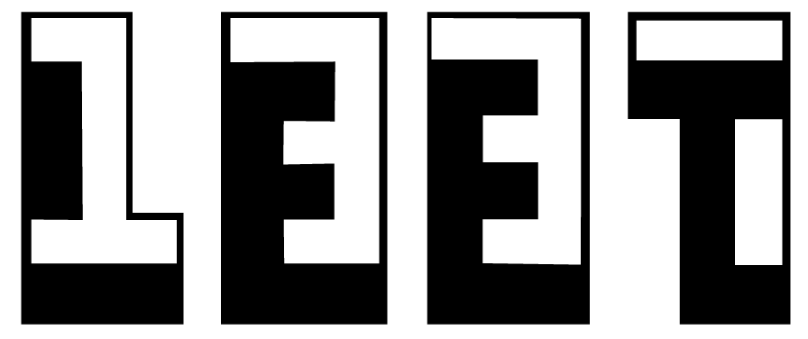

<p align="center" id="top">
  
</p>

<p align="center">
    <em>This repository contains all my work-projects during the 1337-42Network pool</em>
</p>

<p align="center">
  <a href="https://ez7mz.me" target="_blank">
        
  </a>&emsp;
  <a href="https://www.linkedin.com/in/ez7mz/" target="_blank">
    
  </a>&emsp;
  <a href="https://www.instagram.com/ez7m.z/" target="_blank">
    
  </a>
</p>

---
<br>

# 🏊🏻‍♂️ Pool Or Piscine
The Piscine is an intensive, full-time, 4-week long immersion on the 1337 campus with other eligible candidates like yourself. During this month, we will test your motivation to become a world-class programmer, find out if you are #BornToCode and if you can excel in our peer-to-peer learning environment. The Piscine requires your full-time commitment.

⚠️ `The Piscine is the only way to become a student at 1337 and be fully admitted to the course.`

<br>

# 🎲 My Experience
It was one in the best experiences in my life because a lot of things including the learning side and enjoying side. I learned a lot of stuff although I already have an experience in coding when I was there I felt like I really need more hard work to keep going, with all of that I can't forget all the fun times I spent there with some people I never thought that are even exist on earth. and the most valuable thing I learned is that Collaboration is more mush easy to reach the goal in the two ways Easy and Fast. and finally like we said in our language:  `"Wast dahk kayena Lkhedma"`.

<br>

# 👨🏻‍💻 My work
My Piscine was in the period between 📅 **18, Jul 1022** AND 📅 **12, Aug 2022**. I reached 📈 **`Lvl 9.61`** which got me **`Top #6`** ⭐ in my Piscine.

<div align="left">
    <table width=100%>
        <thead border=1>
            <th>Project Title</th>
            <th>Subject</th>
            <th>Solution</th>
            <th>Grade</th>
        </thead>
        <tr>
            <td>Shell00</td>
            <td> <a href="">Subject</a> </td>
            <td> <a href="https://github.com/ez7mz/1337-POOL-42Network/tree/main/Solutions/Shell00">Solution</a> </td>
            <td ></td>
        </tr>
        <tr>
            <td>Shell01</td>
            <td> <a href="">Subject</a> </td>
            <td> <a href="https://github.com/ez7mz/1337-POOL-42Network/tree/main/Solutions/Shell01">Solution</a> </td>
            <td></td>
        </tr>
        <tr>
            <td>C00</td>
            <td> <a href="">Subject</a> </td>
            <td> <a href="https://github.com/ez7mz/1337-POOL-42Network/tree/main/Solutions/C00">Solution</a> </td>
            <td></td>
        </tr>
        <tr>
            <td>C01</td>
            <td> <a href="">Subject</a> </td>
            <td> <a href="https://github.com/ez7mz/1337-POOL-42Network/tree/main/Solutions/C01">Solution</a> </td>
            <td></td>
        </tr>
        <tr>
            <td>C02</td>
            <td> <a href="">Subject</a> </td>
            <td> <a href="https://github.com/ez7mz/1337-POOL-42Network/tree/main/Solutions/C02">Solution</a> </td>
            <td></td>
        </tr>
        <tr>
            <td>C03</td>
            <td> <a href="">Subject</a> </td>
            <td> <a href="https://github.com/ez7mz/1337-POOL-42Network/tree/main/Solutions/C03">Solution</a> </td>
            <td></td>
        </tr>
        <tr>
            <td>C04</td>
            <td> <a href="">Subject</a> </td>
            <td> <a href="https://github.com/ez7mz/1337-POOL-42Network/tree/main/Solutions/C04">Solution</a> </td>
            <td></td>
        </tr>
        <tr>
            <td>C05</td>
            <td> <a href="">Subject</a> </td>
            <td> <a href="https://github.com/ez7mz/1337-POOL-42Network/tree/main/Solutions/C05">Solution</a> </td>
            <td></td>
        </tr>
        <tr>
            <td>C06</td>
            <td> <a href="">Subject</a> </td>
            <td> <a href=""https://github.com/ez7mz/1337-POOL-42Network/tree/main/Solutions/C06>Solution</a> </td>
            <td></td>
        </tr>
        <tr>
            <td>C07</td>
            <td> <a href="">Subject</a> </td>
            <td> <a href="https://github.com/ez7mz/1337-POOL-42Network/tree/main/Solutions/C07">Solution</a> </td>
            <td></td>
        </tr>
        <tr>
            <td>C08</td>
            <td> <a href="">Subject</a> </td>
            <td> <a href="https://github.com/ez7mz/1337-POOL-42Network/tree/main/Solutions/C08">Solution</a> </td>
            <td></td>
        </tr>
        <tr>
            <td>C09</td>
            <td> <a href="">Subject</a> </td>
            <td> <a href="https://github.com/ez7mz/1337-POOL-42Network/tree/main/Solutions/C09">Solution</a> </td>
            <td></td>
        </tr>
        <tr>
            <td>Rush00</td>
            <td> <a href="">Subject</a> </td>
            <td> <a href="https://github.com/ez7mz/1337-POOL-42Network/tree/main/Solutions/Rush00">Solution</a> </td>
            <td></td>
        </tr>
        <tr>
            <td>Exam00</td>
            <td> -- </td>
            <td> -- </td>
            <td> </td>
        </tr>
        <tr>
            <td>Exam01</td>
            <td> -- </td>
            <td> -- </td>
            <td> </td>
        </tr>
        <tr>
            <td>Exam02</td>
            <td> -- </td>
            <td> -- </td>
            <td> </td>
        </tr>
        <tr>
            <td>Final Exam</td>
            <td> -- </td>
            <td> -- </td>
            <td> </td>
        </tr>
    </table>
</div>

<br>

# How to get Documents
<div class="termy">

```console
$ git clone https://github.com/ez7mz/1337-POOL-42NETWORK.git

---> 100%
```

</div>
<p align="left">
    <a href="#top">
        [Back to top]
    </a>
</p>

---

<p align="right">
    <a href="https://ez7mz.me/">&copy; ez7mz 2022</a>
</p>
 
